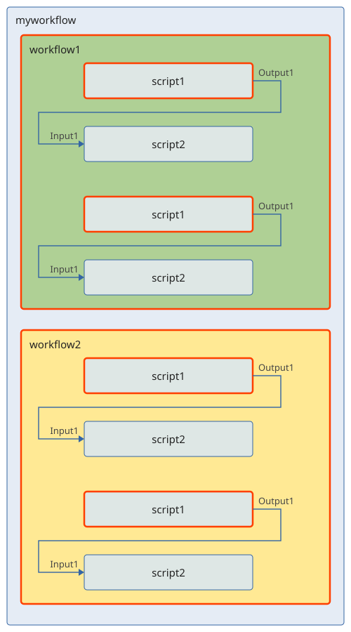
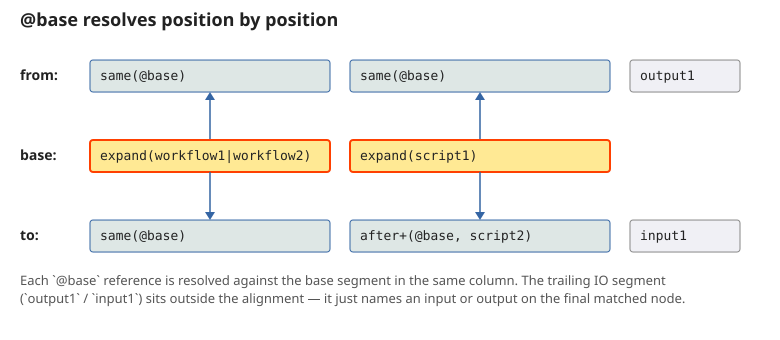
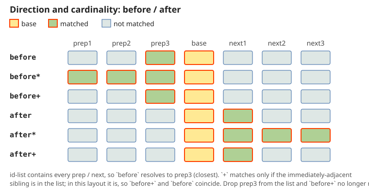
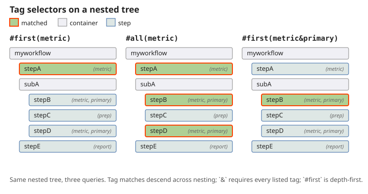
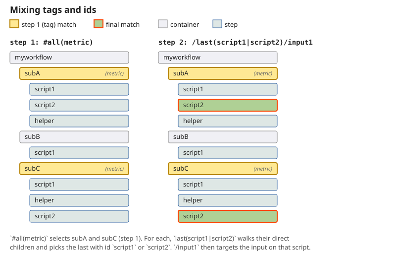

This page assumes the [LQL tutorial](./link-query-language). It covers
the queries a dynamic workflow needs, then one example per topic on a
single workflow. The
[LQL reference](./link-query-language-reference) lists every selector
and flag. Form logic built from rules, such as computed defaults and
lookup tables, is in [Rules and checks](./rules-and-checks#worked-cases).

## Base path and `expand`

Many links fan out across repeated parts of a workflow: every step of a
given type, every workflow inside a parent, every matching tag. LQL
expresses this with a **base path** and **reference selectors**.

The `base` field of a link is itself a query, conventionally named
`base`. Inside `base`, the `expand` selector matches like `all` with one
difference: every match produces a separate **link instance**. Each
instance resolves its own `from` and `to`, whose reference selectors
(`same`, `before`, `after`) take the base query name prefixed with `@`
and anchor to that instance's match. The link definition is a template
that creates many links at once.

```
{
  id: 'mylink1',
  base: 'base:expand(workflow1|workflow2)/expand(script1)',
  from: 'in:same(@base)/same(@base)/output1',
  to: 'out:same(@base)/after+(@base, script2)/input1',
}
```



Assuming `mylink1` is defined inside `myworkflow`:

- `expand(workflow1|workflow2)` matches both workflows, and
  `expand(script1)` matches the two `script1` nodes inside each. That is
  four base matches, drawn with red borders.
- For every base match, `from` resolves `same(@base)` to the node the
  base picked at each segment, then takes `output1` on that script.
- `to` resolves the same workflow, then `after+(@base, script2)` takes the
  node right after the base's `script1` when its id is `script2`, and
  targets its `input1`.

Four base matches give four instances of `mylink1`. Remove the trailing
`script2` from either workflow and that `script1` has no `after+` match,
so the count drops to three.

Every `@base` reference in `from` and `to` is aligned by position with
the corresponding segment of `base`:



`same(@base)` takes an optional id list as a filter. When the base
matches a wider set than the link should accept, the list narrows it:

```
{
  base: 'base:expand(workflowA|workflowB|workflowC)',
  from: 'in:same(@base, workflowA|workflowB)/step/result',
  to: 'out:same(@base, workflowA|workflowB)/next/value',
}
```

The instances created for `workflowC` have no `from` match and are
dropped.

## Direction and cardinality

`before` and `after` scan from the base match in one direction and keep
a different number of matches. The bare form keeps the first match in
that direction, `*` keeps every match, and `+` matches only when the
**immediately adjacent** node has one of the listed ids.

Each row shows the matches of `before(@base, prep1|prep2|prep3)` and
`after(@base, next1|next2|next3)`:



Both selectors take an optional third argument, a `|`-list of **stop
ids**. The scan halts at the first node whose id is in the list, even if
a match lies further along. This confines a relative search to the region
between two known steps:

```
src:before(@base, dataPrep, resetStep)/output
```

matches the nearest preceding `dataPrep`, but gives up when a
`resetStep` comes first. Combined with `expand`, it confines each
instance to its own section:

```
{
  base: 'base:expand(section)',
  from: 'in:before(@base, dataPrep, resetStep)/output',
  to: 'out:same(@base)/result',
}
```

## Tags

Any selector matches by [tag](./configuration#tags) instead of id when
prefixed with `#`. Tag arguments combine with AND (`&`), unlike id
arguments, which combine with OR (`|`), because one node can carry
several tags. Tag matching also crosses nesting boundaries: `#all(metric)`
finds every descendant tagged `metric` at any depth, but never travels
upward past the link's host workflow.

For the link engine, tags are a more flexible kind of id with different
combination rules. Position selectors work with tags as with ids, except
that the `+` modifier does not exist for tags, since adjacency has no
meaning across nesting levels.



A pure tag query matches the first descendant, depth first, that carries
both tags:

```
#first(tag1&tag2)
```

Tags and ids mix freely. Each segment resolves against the result of the
previous one:

```
#all(metric)/last(script1|script2)/input1
```

This matches every descendant tagged `metric`, then the last direct child
of each whose id is `script1` or `script2`, then its `input1`.



Two uses of tags in links: collecting heterogeneous nodes into one
query, such as `sinks:#all(report)/result`, and narrowing a workflow by
id before fanning out by tag, such as
`src:#first(workflowA)/#all(metric)/result`.

## Wildcard io selectors {#wildcard-selectors}

The tutorial's `template` flag lists io names by hand. `outputs(nqName)`
and `inputs(nqName)` pull the list from the script's declaration instead.
The argument is the script's `nqName`, and an optional `|`-list excludes
ios. Expansion happens at config-processing time.

```
{
  from: 'in_(template):script1/outputs(MyPkg:Script1)',
  to: 'out_(template):script2/inputs(MyPkg:Script2, debug|verbose)',
}
```

`outputs(...)` always pulls outputs and `inputs(...)` always pulls
inputs, whichever side they appear on. A `_(template)` prefix expands to
aliases equal to the io names, and the slot id is then the entry's
0-based index on its side, so several anonymous templates stay
addressable without colliding with named ones. How the
[default handler](./link-types#default-handler) pairs template slots is
described with the data links.

## Advanced examples

Every example below lives in this one dynamic workflow. `load` produces
a table, `solver` fits a model from a preset, any number of `analysis`
steps score it, `reset` starts a new section, and `summary` is a nested
workflow whose `metrics` step reports. `solver` and `metrics` carry the
`report` tag.

```
{
  id: 'screening',
  type: 'dynamic',
  stepTypes: [
    {id: 'load', nqName: 'Pkg:LoadTable'},                       // out: table
    {id: 'solver', nqName: 'Pkg:Solver', tags: ['report']},      // in: table, preset, a, b, c; out: result
    {id: 'analysis', nqName: 'Pkg:Analysis'},                    // in: table, column, rows, baseline; out: score
    {id: 'reset', nqName: 'Pkg:Reset'},                          // starts a new section
    {id: 'summary', type: 'static', steps: [
      {id: 'metrics', nqName: 'Pkg:Metrics', tags: ['report']},  // in: scores; out: result
    ]},
  ],
  initialSteps: ['load', 'solver', 'analysis', 'analysis', 'summary'],
  links: [/* the examples below */],
}
```

The same configurations run as the LibTests category
"ComputeUtils: Driver docs cases" on mock functions, so they stay valid.

### Chain each analysis to the next one

One link definition, one instance per analysis. Each instance reads its
own score and writes it as the baseline of the analysis right after it.

```
{
  id: 'chain',
  base: 'base:expand(analysis)',
  from: 'prev:same(@base)/score',
  to: 'next:after+(@base, analysis)/baseline',
}
```

`expand(analysis)` creates an instance for every analysis, including the
ones the user adds later. `same(@base)` is that analysis, and
`after+(@base, analysis)` is its immediate successor, when that is an
analysis too. The last analysis has no successor, so its instance is
dropped, and an analysis followed by `reset` gets no link either.

### Feed each analysis from the load of its section

```
{
  id: 'feed',
  base: 'base:expand(analysis)',
  from: 'table:before(@base, load, reset)/table',
  to: 'input:same(@base)/table',
}
```

`before(@base, load, reset)` scans backward from the analysis for the
nearest `load` and gives up at a `reset`. In the sequence `load, analysis,
reset, analysis` the first analysis gets the table and the second gets no
link, because the scan meets `reset` first. Without the stop id the
second analysis would read the load of the previous section.

### Collect every score before the summary

```
{
  id: 'collect',
  base: 'base:expand(summary)',
  from: 'scores:before*(@base, analysis)/score',
  to: 'target:same(@base)/metrics/scores',
  handler: ({controller}) => controller.setAll('target', controller.getAll('scores')),
}
```

`before*` keeps every preceding analysis in workflow order, and `getAll`
reads them as a list. `all(analysis)` would read every analysis in the
workflow; anchored to the summary, the query reads only those before it,
which matters once a second summary or a `reset` divides the workflow
into sections.

### Gate the run on every report

```
{
  id: 'reportsReady',
  type: 'pipelineValidator',
  from: 'results:#all(report)/result',
  to: 'self',
  handler: ({controller}) => {
    const ready = controller.getAll('results').filter((result) => result != null).length;
    controller.setValidation('self', ready === 2 ? undefined : {errors: [`${ready} of 2 reports ready`]});
  },
}
```

`#all(report)` matches `solver` at the root and `metrics` inside
`summary` in one query, because tag matching descends through nesting.
An id query would need two entries with two paths. The validator writes
to `self`, the host workflow.

### Everything load produces that solver accepts

```
{
  id: 'loadToSolver',
  from: 'in_(template):load/outputs(Pkg:LoadTable)',
  to: 'out_(template):solver/inputs(Pkg:Solver, preset|a|b|c)',
}
```

Both lists come from the scripts' declarations at config-processing
time, so the link needs no change when `LoadTable` gains an output. The
default handler pairs the two sides by io name and drops what only one
side has: `table` is copied, and the excluded `preset`, `a`, `b` and `c`
are left to a lookup, see
[Compound presets](./rules-and-checks#compound-presets).
